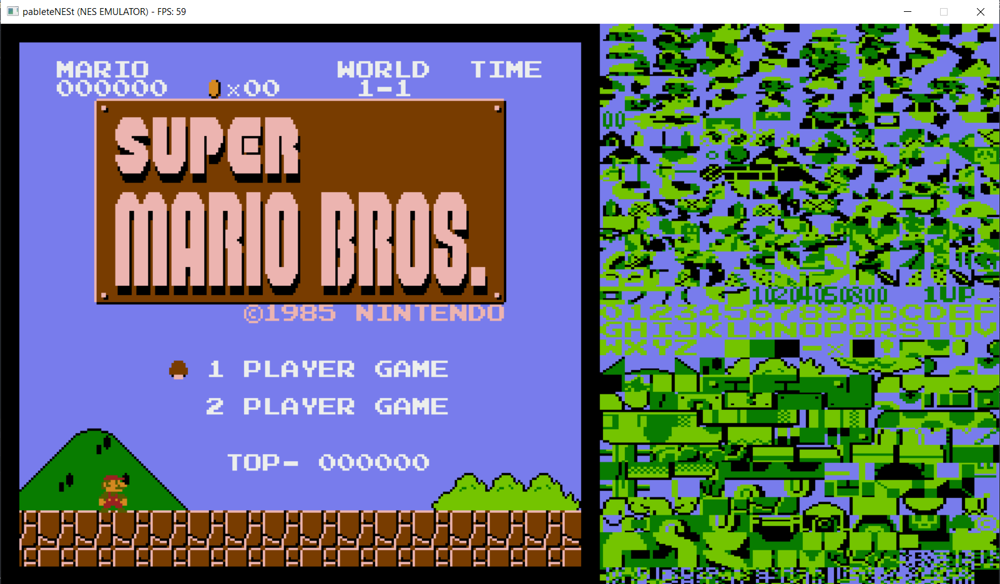
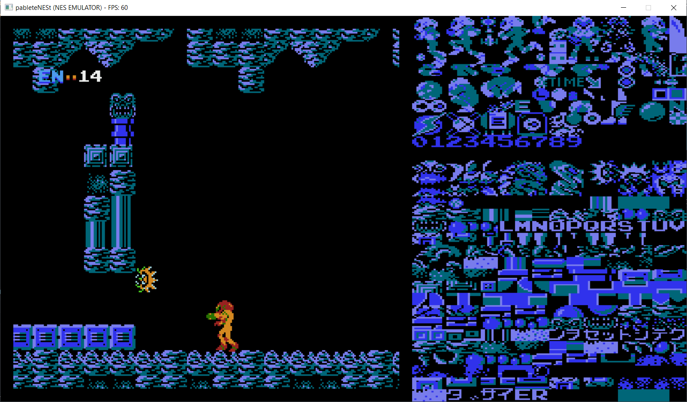
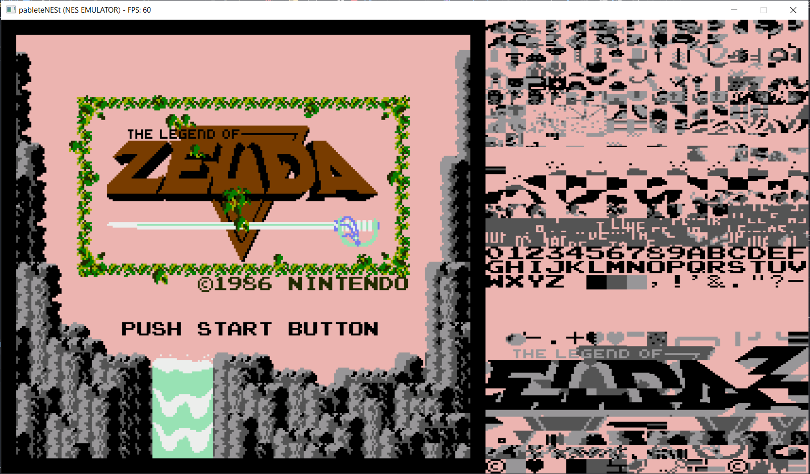
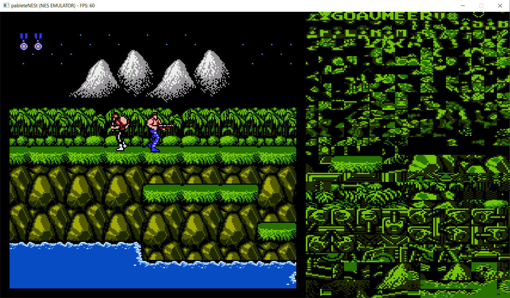
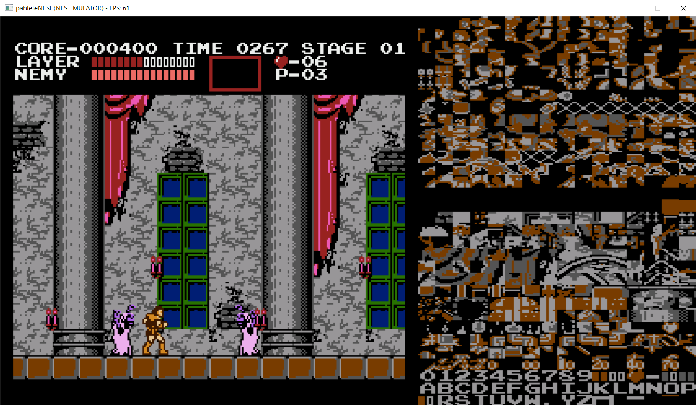

pableteNESt
===========

pableteNESt is a NES console emulator written C++ with different levels of accuracy depending on the component emulated. Being my first emulator, the goals are learning and explore deeper into emulation universe. Thus, this emulator is almost "complete" but still under development.

Features
--------

- Instruction-level accurate CPU sufficient for most of the games in the NES catalog.
- Cycle-level accuracy for the PPU and APU components of the hardware to allow playing a wide variety of games.
- Fairly acceptable 8-bit sound emulation.
- Decent amount of mappers supported.
- The frontend version provides the following functionality:
  · Save/Load states
  · Bilinear filtering mode
  · Screenshots
  · PPU nametables and chr data debugging views
  · Open/Load selected NES roms.
  · Restart/Reset games
  · Saving game OnChip RAM memory between runs.

## Mappers supported

- Mapper 0 (NROM)
- Mapper 1 (MMC1) -> "Most of them"
- Mapper 2 (UxROM)
- Mapper 3 (CNROM)
- Mapper 7 (AxROM)
- Mapper 66 (GxROM)

## Examples of famous playable games
- Super Mario Bros
- The Legend of Zelda
- Zelda II
- Donkey Kong
- Castlevania
- Pac-Man
- Ice Climber
- Contra
- Tetris
- DuckTales 1 and 2
- Arkanoid
- Gradius
- Metroid
- Megaman 1 and 2
- Prince of Persia
- Metal Gear
- Ninja Gaiden
- Double Dribble

Among other playable games. Some supported games by the mappers listed above may present some kind of bug or issue.

## Future development

- Add more debugging tools.
- Add support for mappers MMC3 and MMC5.
- Improve overall appearance of the emulator GUI.
- Improve and correct bugs in audio chip.
- Rewrite CPU to be cycle-level accurate.
- Polish and fix possible bugs.
